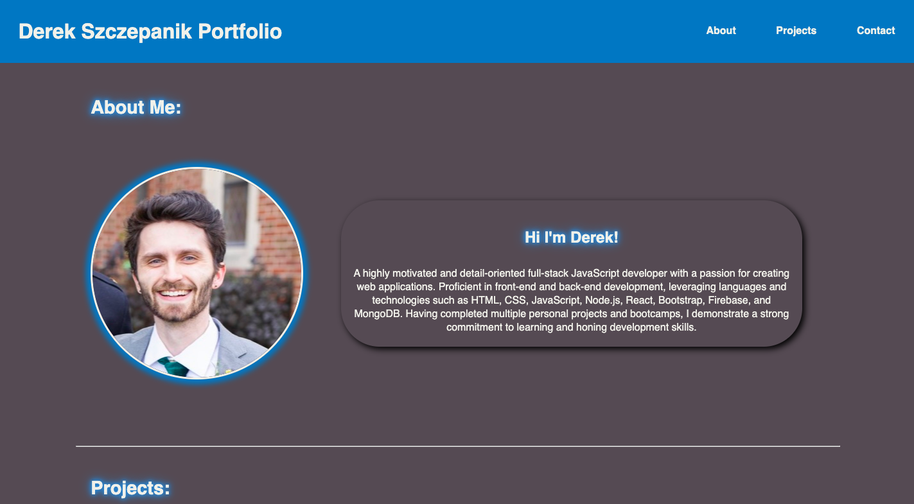

# Advanced CSS: Portfolio

You can view the page here ---> [Challenge-2-Professional-Portfolio](https://lone1ne.github.io/Challenge-2-Professional-Portfolio/)

## Description

This repository contains a responsive portfolio website developed for showcasing my work as a web developer. The portfolio contains sections about me, my work and ways to contact me. The portfolio was developed using advanced CSS techniques, such as flexbox, media queries, and CSS variables.

## User Story

...

AS AN employer
I WANT to view a potential employee's deployed portfolio of work samples
SO THAT I can review samples of their work and assess whether they're a good candidate for an open position
...

## Acceptance Criteria

...

GIVEN I need to sample a potential employee's previous work
WHEN I load their portfolio
THEN I am presented with the developer's name, a recent photo or avatar, and links to sections about them, their work, and how to contact them
WHEN I click one of the links in the navigation
THEN the UI scrolls to the corresponding section
WHEN I click on the link to the section about their work
THEN the UI scrolls to a section with titled images of the developer's applications
WHEN I am presented with the developer's first application
THEN that application's image should be larger in size than the others
WHEN I click on the images of the applications
THEN I am taken to that deployed application
WHEN I resize the page or view the site on various screens and devices
THEN I am presented with a responsive layout that adapts to my viewport
...

## Screenshot

The following image is a screenshot of the application:

## Usage

Navigate through the sections to learn more about me, see examples of my work, and find out how to contact me. Each project image in the 'projects' section is a clickable link that will take you directly to the deployed application.
